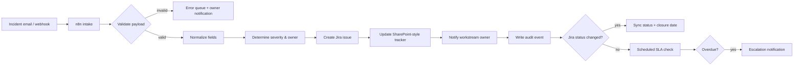

# Enterprise Workflow Automation Hub

A business-oriented automation portfolio showing how recurring project/operations coordination can be converted into traceable, auditable workflows using **n8n, Jira, Microsoft 365 / SharePoint, Teams/Slack-style notifications and Power Automate design patterns**.

> **Portfolio case study.** The integrations use synthetic data and placeholder endpoints. No employer credentials, production URLs or confidential data are included.

## Business problem

Project teams often manage incidents, blockers, risks and actions across email, chat, spreadsheets and Jira. This creates duplicate entry, delayed escalation, missed owners and weak auditability.

The target operating model is a single workflow where a new incident or blocker is captured once, normalized, routed to the right system, logged in a central tracker and followed through to closure.

## Featured automation: Automated RAID / OPL Intake



## Repository contents

- `n8n/raid-opl-intake.workflow.json` — importable n8n example workflow using Webhook, Code, IF and HTTP Request nodes.
- `power-automate/raid-opl-blueprint.json` — platform-neutral Power Automate solution blueprint showing triggers/actions/conditions.
- `schemas/incident-payload.schema.json` — contract for incoming incident/blocker data.
- `samples/incident-example.json` — synthetic example payload.
- `docs/architecture.md` — component design, ownership and control points.
- `docs/error-handling.md` — retries, idempotency, dead-letter handling and operational controls.
- `docs/security-and-governance.md` — credential, logging and least-privilege guidance.

## Example payload

```json
{
  "source": "teams",
  "external_id": "MSG-2048",
  "project": "ERP-WAVE-2",
  "summary": "UAT environment unavailable",
  "type": "blocker",
  "severity": "high",
  "owner_email": "workstream.owner@example.com",
  "due_date": "2026-09-15"
}
```

## Automation design principles demonstrated

- Single source of capture with downstream synchronization
- Schema validation before ticket creation
- Severity-based routing and escalation
- Idempotency key to prevent duplicate Jira tickets
- Central audit events for observability
- Retry strategy for transient failures
- Dead-letter path for manual intervention
- Explicit ownership and SLA logic

## Business impact hypothesis

For a team processing 80 coordination items per week, replacing four manual handoffs with a single automated workflow can materially reduce duplicate entry and response latency. Any actual savings should be measured in a live environment using baseline handling time, failure rate and reopening rate.

## Suggested interview discussion

A useful way to present this project is: *“I designed the workflow around operational controls rather than around tools. The key design decisions were data validation, idempotency, ownership, traceability and an escalation path. n8n or Power Automate is the execution layer; the business value comes from reducing coordination friction without losing governance.”*
